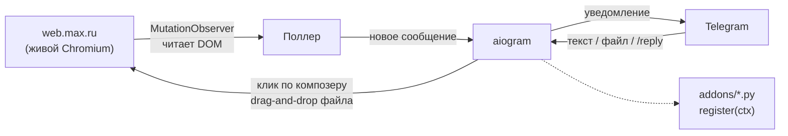

<div align="center">

# maxbot-lite

**MAX → Telegram, однофайловый мост.** Без официального API — живой
Chromium читает интерфейс web.max.ru так же, как его читал бы человек.

[](#требования)
[](.github/workflows/lint.yml)
[](LICENSE)

</div>

---

> **Сознательно урезанная версия.** Полный бот (топики-мост, история с
> поиском, декодер сокета, щиты от дублей, скачивание медиа) — отдельный
> приватный проект. Здесь — ядро: приём сообщений, отправка текста и
> файлов, плюс точка входа для собственных аддонов.

## Возможности

| | |
|---|---|
| ⬅️ | Новые сообщения из **всех** чатов MAX (включая ниже подгиба списка) — уведомлением в личку бота, с кнопкой «Открыть чат» |
| ➡️ | Текст — в открытый чат MAX, с проверкой доставки |
| ➡️ | Фото / видео / документ / голосовое — как файл (подпись досылается отдельным сообщением) |
| ↩️ | **Ответ тапом** — кнопки «↩️ #N» под снимком чата |
| 🔎 | `/find <слово>` — поиск по видимой истории (без БД) |
| 🔇 | Мьют чатов через `.env` |
| 🧩 | **Аддоны** — необязательные модули в `addons/`, один файл = одна фича |

Полный список команд — в разделе [Использование](#использование).

<details>
<summary><b>Что не реализовано — осознанно</b></summary>
<br>

- История/БД/поиск по прошлому — отсутствует; пока бот выключен,
  сообщения **не накапливаются** (при старте видно только последнее
  превью каждого чата).
- Медиа из MAX приходят **заглушками** («📷 Фото», «🎤 Голосовое») — байты
  не загружаются.
- Пересылка и редактирование собственных сообщений — не реализованы (есть
  в полном боте).
- Один пользователь: `OWNER_TG_ID`, заданный в конфигурации; остальные
  запросы игнорируются.

</details>

## Архитектура



Родной WebSocket MAX **не используется** — только чтение DOM. Прямое
подключение к сокету MAX создаёт риск блокировки аккаунта. Подробности и
встроенные защитные механизмы — в разделе
[«Архитектура (подробно)»](#архитектура-подробно).

## Требования

- **Python 3.10+** (код использует `str | None`; на более старых версиях
  установка проходит, а запуск завершается `SyntaxError` при импорте).
- Windows / Linux / macOS — Playwright поддерживает все три платформы.

## Установка

```bash
python -m venv .venv && .venv\Scripts\activate      # Windows (linux: source .venv/bin/activate)
pip install -r requirements.txt
playwright install chromium
copy .env.example .env                              # linux: cp
# указать TG_BOT_TOKEN (от @BotFather) и OWNER_TG_ID (узнать через @userinfobot)
python maxbot_lite.py
```

При первом запуске откроется окно Chromium с web.max.ru — требуется вход
в аккаунт MAX (код из SMS). Профиль сохраняется в `max_session/`, повторный
вход не требуется.

> ⚠️ `HEADLESS=false` (значение по умолчанию) обязателен: в headless-режиме
> MAX не отдаёт контент. Окно браузера должно оставаться открытым —
> сворачивание допустимо, закрытие — нет.

## Использование

1. `/start` или **💬 Чаты** — список чатов MAX кнопками, со счётчиками.
2. Тап по чату → отображаются последние сообщения с номерами `#N`.
3. Текстовое сообщение уходит в MAX. Файл — отправляется файлом.
4. `/reply <N> <текст>`, `/delete <N>` — действия по номерам из снимка
   (действительны до перерисовки истории).
5. `/open <имя>` · `/find <слово>` · `/who` — навигация и поиск по
   видимому содержимому.
6. `/screen` · `/status` · `/logs` — диагностика.

## Диагностика неполадок

<details>
<summary><b>«Заполни .env» при запуске</b></summary>
<br>

`TG_BOT_TOKEN` или `OWNER_TG_ID` не заданы или не считались. Следует
проверить, что файл `.env` (не `.env.example`) находится рядом с
`maxbot_lite.py`, значения указаны без кавычек.
</details>

<details>
<summary><b>Список чатов не заполняется</b></summary>
<br>

Возможные причины: MAX ещё не отрисовал список (в течение первой секунды
после открытия страницы), либо вёрстка MAX изменилась и текущие
селекторы не совпадают (см. [Риски](#️-риски), пункт 3) — в этом случае
`logs/bot-lite.log` содержит явную запись об этом, зависание исключено.
</details>

<details>
<summary><b>Окно Chromium не открывается / бот не отвечает при старте</b></summary>
<br>

Следует проверить значение `HEADLESS=false` в `.env`: в headless-режиме
MAX не отдаёт контент — это обязательное условие, а не опечатка.
</details>

<details>
<summary><b>MAX повторно запрашивает код из SMS после переноса на другую машину</b></summary>
<br>

Вероятная причина: копия `max_session/` была сделана при **работающем**
браузере (профиль содержит незакрытые файлы блокировок). Необходимо
полностью остановить бота, скопировать `max_session/` заново и запустить
на новом месте.
</details>

<details>
<summary><b>Получено сообщение «не ушло», хотя текст появился в MAX</b></summary>
<br>

Редкий гоночный случай: композер MAX не успел очиститься к моменту
проверки. Как правило, не повторяется; при стабильном воспроизведении на
одном чате рекомендуется зафиксировать точное место (строку/лог) — это
может указывать на новый паттерн вёрстки.
</details>

## Архитектура (подробно)

- MutationObserver инициирует работу поллера; поллер сравнивает превью
  ячеек и формирует уведомления. Собственный текст пользователя («Вы: …»)
  и статусные строки («печатает») уведомлениями не считаются.
- Список чатов виртуализирован: чаты ниже видимой области появляются в
  DOM только при прокрутке — поэтому раз в 10 минут список программно
  прокручивается, и новые чаты добавляются в кэш.
- Исходящие сообщения — клик по композеру, `insert_text`, кнопка
  отправки; файлы — CDP `Input.dispatchDragEvent` в зону чата.

**Встроенные защитные механизмы** (перенесены из полной версии бота):
клик по чату сверяется с содержимым топбара (иначе сообщение может уйти
не в тот чат); после отправки проверяется пустота композера (иначе
возможен ложноположительный статус доставки); эмодзи считываются
обходом DOM; каждый вызов `evaluate` ограничен таймаутом; DOM-операции
выполняются под общим замком; после трёх неудачных попыток браузер
перезапускается автоматически.

> ⚠️ **User-Agent зафиксирован статически** (`Chrome/124.0.0.0`, см.
> `start_browser()`) — унаследовано из более раннего кода. Версия
> Chromium, устанавливаемая Playwright, со временем меняется, а эта
> строка — нет. При проблемах с распознаванием клиента это первое место
> для проверки (либо использовать значение динамически: `browser.version`).

## Структура кода

Один файл, 2000+ строк, размечен разделами-комментариями (`# --- ... ---`).
Основные ориентиры:

| Строки | Раздел | Назначение |
|---|---|---|
| ~110 | `PageLock` | все DOM-операции проходят через единый замок — отправная точка при зависаниях |
| ~220 | `start_browser` | запуск Chromium, MutationObserver, перезапуск при сбое |
| ~283 | Список чатов | чтение превью, виртуализация списка |
| ~384 | `poller_loop` | основной цикл входящих: сравнение превью, формирование уведомлений |
| ~519 | `reply_to_item`, `delete_item` | Reply/удаление через контекстное меню |
| ~899 | `open_chat` / `send_text` | отправка текста — наиболее стабильный участок, изменения требуют осторожности |
| ~1077 | Загрузка файлов | CDP drag-and-drop, наиболее чувствительный механизм |
| ~1286 | `watchdog_loop` | проверка живости процесса, автоматический перезапуск |
| ~1327 | Сторона Telegram | команды и обработчики aiogram |
| ~1831 | Аддоны | загрузчик `addons/`, `AddonCtx` |

Для разработки собственного аддона рекомендуется начать с изучения
`addons/addon_digest.py` — рабочего примера того же контракта.

## Аддоны

Ядро реализовано в одном файле, а необязательные функции размещаются по
одному `.py`-файлу в папке `addons/`. Наличие файла включает функцию,
удаление — отключает. Каждый аддон экспортирует функцию `register(ctx)`,
вызываемую ядром при старте.

`ctx` — единственная точка связи с ботом (импорт ядра не требуется):

| Поле | Назначение |
|---|---|
| `ctx.log` | логгер (пишет в общий лог) |
| `ctx.env(key, default)` | значение из `.env` |
| `ctx.owner_id`, `ctx.bot`, `ctx.dp` | id владельца и объекты aiogram |
| `ctx.known` | кэш чатов `{id: {name, last_message, unread, …}}` |
| `ctx.page()` | текущая страница браузера (функция — пересоздаётся при перезапуске) |
| `await ctx.send_owner(text)` | отправка сообщения владельцу |
| `ctx.on_message(cb)` | подписка на новое сообщение: `cb(chat, why)` |
| `ctx.spawn(coro, name)` | фоновая задача под управлением ядра |
| `await ctx.send_text / ctx.open_chat` | действия в MAX |

В комплект входит демонстрационный аддон `addons/addon_digest.py` —
сводка непрочитанных сообщений с заданным интервалом (`DIGEST_EVERY_MIN`
в `.env`). Файл подробно прокомментирован как образец для разработки
собственных аддонов.

> ⚠️ Назначение аддонов — логика на стороне бота (сводки, фильтры,
> расписания). Функциональность, затрагивающая протокол MAX (сокет,
> перехват медиа, реакции), сознательно не включена: это отдельный
> приватный проект.

**Не будет реализовано в виде аддона lite** (независимо от технической
осуществимости): приём и постановка реакций, перехват реальных
медиа-данных, любое взаимодействие с внутренним WebSocket MAX. Причина —
не сложность реализации, а то, что она требует протокольных деталей,
которые не публикуются. Материалы для самостоятельного изучения — раздел
[«Архитектура»](#архитектура), описывающий общий подход к разведке
интерфейса.

📘 Дополнительные материалы в корне репозитория:
[`КАК-ДУМАТЬ-разведуя-MAX.md`](КАК-ДУМАТЬ-разведуя-MAX.md) (методология
анализа хрупкого интерфейса, основанная на разборе реальных ошибок) и
[`ТЕХ-ПРИКОЛЫ-И-МИНЫ.md`](ТЕХ-ПРИКОЛЫ-И-МИНЫ.md) (задокументированные
особенности MAX и Telegram Bot API — без протокольных деталей, но с
фактами, сокращающими время отладки).

## ⚠️ Риски

1. **Блокировка аккаунта MAX.** Неофициальная автоматизация клиента.
   Вероятность низкая при личном использовании, но не нулевая — не
   рекомендуется применять к основному аккаунту без резервного варианта
   или использовать бота в интенсивном режиме.
2. **Токен бота эквивалентен праву отправки сообщений от имени
   владельца.** Утечка `TG_BOT_TOKEN` позволяет третьим лицам отправлять
   сообщения через привязанные чаты. Файл `.env` должен храниться закрыто,
   токен не подлежит публикации.
3. **Вёрстка MAX подвержена изменениям.** Селекторы привязаны к текущей
   версии web.max.ru — обновление интерфейса может нарушить разбор
   страницы. В этом случае в лог заносится явная запись «чатов не
   извлеклось».
4. **Пропуски сообщений при выключенном боте** — см.
   [раздел о нереализованных возможностях](#что-не-реализовано--осознанно).
5. Гарантии отсутствуют. Условия использования — см. [`LICENSE`](LICENSE)
   (MIT).

## Известные ограничения

- Номера `#N` для `/reply`/`/delete` действительны до перерисовки истории.
- Медиа передаются заглушками (см. выше).
- Удаление поддерживается только для текстовых сообщений владельца.
- Интерфейс MAX должен быть на русском или английском языке.

## Перенос на другую машину

Рекомендуемый способ — повторный вход в MAX на новой машине (код из SMS,
около 2 минут). При недоступности номера/SMS: папку `max_session/`
следует копировать целиком при **остановленном** боте (копия при
работающем браузере может оказаться повреждённой, что также потребует
входа по SMS). Папка профиля эквивалентна учётным данным MAX — передача
допустима только через SSH или физический носитель, не через мессенджеры
или облачные сервисы.

## Файлы

| Файл | Назначение |
|---|---|
| `maxbot_lite.py` | код бота |
| `addons/` | необязательные модули |
| `.env` | токен и идентификатор владельца (создаётся из `.env.example`) |
| `max_session/` | профиль браузера — эквивалент доступа к аккаунту MAX. Публикация недопустима |
| `logs/bot-lite.log` | лог выполнения (доступен через `/logs`) |
| `downloads/` | временные файлы, очищается автоматически |
| `LICENSE` | MIT |
| `CHANGELOG.md` | журнал версий |
| `.github/workflows/lint.yml` | CI: проверка синтаксиса и ruff на каждый push/PR |
| `КАК-ДУМАТЬ-разведуя-MAX.md` | методология анализа хрупкого интерфейса |
| `ТЕХ-ПРИКОЛЫ-И-МИНЫ.md` | задокументированные особенности MAX и Bot API |
