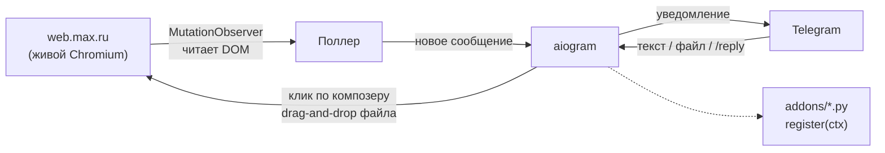

<div align="center">

# maxbot-lite

**MAX → Telegram, однофайловый мост.** Без официального API — живой
Chromium читает интерфейс web.max.ru так же, как его читал бы человек.

[](#требования)
[](.github/workflows/lint.yml)
[](LICENSE)

</div>

---

> **Сознательно урезанная версия.** Полный бот (топики-мост, история с
> поиском, декодер сокета, щиты от дублей, скачивание медиа) — отдельный
> приватный проект. Здесь — ядро: **принимать сообщения, писать и слать
> файлы**, плюс точка входа для своих аддонов.

## Умеет

| | |
|---|---|
| ⬅️ | Новые сообщения из **всех** чатов MAX (включая ниже подгиба списка) — уведомлением в личку, с кнопкой «Открыть чат» |
| ➡️ | Текст — в открытый чат MAX, с проверкой, что реально ушло |
| ➡️ | Фото / видео / документ / голосовое — как файл (подпись досылается отдельным сообщением) |
| ↩️ | **Ответить тапом** — кнопки «↩️ #N» под снимком чата |
| 🔎 | `/find <слово>` — поиск по видимой истории (без БД) |
| 🔇 | Мьют чатов через `.env` |
| 🧩 | **Аддоны** — необязательные модули в `addons/`, один файл = одна фича |

Полный список команд — в разделе [Использование](#использование).

<details>
<summary><b>НЕ умеет — осознанно</b></summary>
<br>

- История/БД/поиск по прошлому — нет; пока бот выключен, сообщения **не
  копятся** (при старте видно только последнее превью каждого чата).
- Медиа из MAX приходят **заглушками** («📷 Фото», «🎤 Голосовое») — байты
  не тянет.
- Пересылка и правка своих сообщений — нет (есть в полном боте).
- Один пользователь: твой `OWNER_TG_ID`, все остальные игнорируются.

</details>

## Как это устроено



Родной WebSocket MAX **не используется вообще** — только чтение DOM. Свой
сокет к MAX = риск бана аккаунта. Подробности и вшитые предохранители — в
[«Как это устроено» ниже](#как-это-устроено-подробно).

## Требования

- **Python 3.10+** (код использует `str | None`; на более старых версиях
  установка пройдёт, а запуск упадёт `SyntaxError` при импорте).
- Windows / Linux / macOS — Playwright поддерживает все три.

## Установка

```bash
python -m venv .venv && .venv\Scripts\activate      # Windows (linux: source .venv/bin/activate)
pip install -r requirements.txt
playwright install chromium
copy .env.example .env                              # linux: cp
# вписать TG_BOT_TOKEN (от @BotFather) и OWNER_TG_ID (узнать: @userinfobot)
python maxbot_lite.py
```

Первый запуск: откроется окно Chromium с web.max.ru — **войди в аккаунт
MAX** (код из SMS). Профиль сохранится в `max_session/`, дальше вход не
нужен.

> ⚠️ `HEADLESS=false` (по умолчанию) обязателен: в headless MAX не отдаёт
> контент. Окно браузера должно жить — сворачивать можно, закрывать нет.

## Использование

1. `/start` или **💬 Чаты** — список чатов MAX кнопками, со счётчиками.
2. Тап по чату → бот показывает последние сообщения с номерами `#N`.
3. Пиши текст — уйдёт в MAX. Кидай файл — уйдёт файлом.
4. `/reply <N> <текст>`, `/delete <N>` — по номерам из снимка (действуют,
   пока чат не перерисовался).
5. `/open <имя>` · `/find <слово>` · `/who` — навигация и поиск по видимому.
6. `/screen` · `/status` · `/logs` — обслуживание.

## Troubleshooting

<details>
<summary><b>«Заполни .env» при запуске</b></summary>
<br>

`TG_BOT_TOKEN` или `OWNER_TG_ID` пустые или не считались. Проверь, что
`.env` лежит рядом с `maxbot_lite.py` (не `.env.example`), без кавычек
вокруг значений.
</details>

<details>
<summary><b>Чатов не извлеклось / список чатов пуст</b></summary>
<br>

Либо MAX ещё не отрисовал список (первую секунду после открытия
страницы), либо вёрстка MAX обновилась и старые селекторы не совпадают
(см. [Риски](#️-риски), пункт 3) — тогда в `logs/bot-lite.log` будет явная
запись об этом, не тихое зависание.
</details>

<details>
<summary><b>Окно Chromium не открывается / бот виснет на старте</b></summary>
<br>

Проверь `HEADLESS=false` в `.env`: в headless-режиме MAX не отдаёт
контент, это жёсткое требование, не опечатка.
</details>

<details>
<summary><b>MAX снова просит код из SMS после переноса на другую машину</b></summary>
<br>

Копия `max_session/` была снята при **живом** браузере (профиль поймал
незакрытые файлы блокировок). Останови бота полностью, скопируй
`max_session/` заново, запусти на новом месте.
</details>

<details>
<summary><b>Бот прислал «не ушло», хотя текст в MAX появился</b></summary>
<br>

Редкий гоночный случай: композер MAX не успел очиститься к моменту
проверки. Обычно не повторяется; если повторяется стабильно на одном
чате — стоит сообщить, куда именно (номер строки/лог) — возможно, новый
паттерн вёрстки.
</details>

## Как это устроено (подробно)

- MutationObserver будит поллер; поллер сравнивает превью ячеек и шлёт
  уведомления. Свой текст («Вы: …») и статусные строки («печатает»)
  уведомлениями не являются.
- Список чатов виртуализирован: нижние чаты появляются в DOM только у
  окна прокрутки — поэтому раз в 10 минут список тихо прокручивается и
  новые чаты допоминаются в кэш.
- Исходящие — клик по композеру + `insert_text` + кнопка Send, файлы —
  CDP `Input.dispatchDragEvent` в зону чата.

**Вшитые предохранители** (наследие боёв полного бота): клик по чату
сверяется с топбаром (иначе «написал не в тот чат»); после отправки
проверяется пустота композера (иначе «не ушло, а бот сказал ок»); эмодзи
читаются обходом DOM; каждый `evaluate` под таймаутом; DOM-операции под
общим замком; после трёх неответов браузер перезапускается сам.

> ⚠️ **User-Agent захардкожен** (`Chrome/124.0.0.0`, см. `start_browser()`)
> — унаследовано от более раннего кода. Реальный Chromium со временем
> уходит вперёд по версии, а эта строка — нет. Если увидишь проблемы с
> распознаванием клиента — первое, что стоит проверить (или брать версию
> динамически: `browser.version`).

## Как читать код

Один файл, 2000+ строк, размечен разделами-комментариями (`# --- ... ---`).
Основные ориентиры:

| Строки | Раздел | Зачем сюда смотреть |
|---|---|---|
| ~110 | `PageLock` | все DOM-операции идут через один замок — если что-то виснет, начни отсюда |
| ~220 | `start_browser` | запуск Chromium, MutationObserver, рестарт при сбое |
| ~283 | Список чатов | как читаются превью, виртуализация списка |
| ~384 | `poller_loop` | сердце входящих: сравнивает превью, решает, что показать |
| ~519 | `reply_to_item`, `delete_item` | Reply/удаление через popover |
| ~899 | `open_chat` / `send_text` | исходящий текст — самое стабильное место, трогать с опаской |
| ~1077 | Загрузка файлов | CDP drag-and-drop, самая тонкая механика |
| ~1286 | `watchdog_loop` | проба живости, авторестарт браузера |
| ~1327 | TG-сторона | все команды и хендлеры aiogram |
| ~1831 | Аддоны | загрузчик `addons/`, `AddonCtx` |

Свой аддон начни смотреть с `addons/addon_digest.py` — тот же контракт, но
на живом примере.

## Аддоны

Ядро — один файл, а необязательные фичи живут по одному `.py` в папке
`addons/`. **Есть файл — фича есть; убрал файл — нет.** Каждый аддон
экспортирует одну функцию `register(ctx)`, которую ядро зовёт на старте.

`ctx` — единственная связь с ботом (импортировать ядро не нужно):

| Что | Зачем |
|---|---|
| `ctx.log` | свой логгер (пишет в общий лог) |
| `ctx.env(key, default)` | значение из `.env` |
| `ctx.owner_id`, `ctx.bot`, `ctx.dp` | id владельца и объекты aiogram |
| `ctx.known` | кэш чатов `{id: {name, last_message, unread, …}}` |
| `ctx.page()` | текущая страница браузера (функция — пересоздаётся при рестарте) |
| `await ctx.send_owner(text)` | написать владельцу в личку |
| `ctx.on_message(cb)` | подписка на новое сообщение: `cb(chat, why)` |
| `ctx.spawn(coro, name)` | фоновая задача под присмотром |
| `await ctx.send_text / ctx.open_chat` | действия в MAX |

В комплекте — **демо-аддон** `addons/addon_digest.py`: сводка непрочитанного
раз в N минут (`DIGEST_EVERY_MIN` в `.env`). Подробно закомментирован как
образец «как написать свой аддон» — скопируй, переименуй, перепиши логику.

> ⚠️ Аддоны — про логику на стороне бота (сводки, фильтры, расписания).
> Всё, что лезет в протокол MAX (сокет, перехват медиа, реакции) —
> сознательно НЕ здесь: это отдельный приватный проект.

**Сознательно не станет аддоном lite** (даже если технически возможно):
приём/постановка реакций, перехват реальных медиа-байтов, любая работа с
внутренним WebSocket MAX. Причина не в сложности — реализация требует
протокольных деталей, которые не публикуются. Хочешь разобраться сам —
раздел [«Как это устроено»](#как-это-устроено) объясняет общий подход, с
него и стоит начинать собственную разведку.

📘 Собираешься копать глубже сам — два файла в корне репозитория:
[`КАК-ДУМАТЬ-разведуя-MAX.md`](КАК-ДУМАТЬ-разведуя-MAX.md) (привычки
мышления при разведке хрупкого интерфейса — не абстрактная теория, а
разбор реальных ошибок и того, что на них экономит время) и
[`ТЕХ-ПРИКОЛЫ-И-МИНЫ.md`](ТЕХ-ПРИКОЛЫ-И-МИНЫ.md) (конкретные грабли MAX и
Telegram Bot API — без протокольных деталей, но с фактами, которые
экономят часы отладки).

## ⚠️ Риски

1. **Бан аккаунта MAX.** Неофициальная автоматизация клиента. Вероятность
   низкая при личном использовании, но не нулевая — не вешай на боевой
   аккаунт ничего критичного, не гоняй бота «на износ».
2. **Токен бота = право писать от твоего имени в MAX.** Утёкший
   `TG_BOT_TOKEN` позволяет отправлять сообщения твоими чатами. Храни
   `.env` закрытым, токен не публикуй никогда.
3. **Вёрстка MAX меняется.** Селекторы привязаны к текущей версии
   web.max.ru — обновление сайта может сломать разбор. Тогда бот честно
   пишет «чатов не извлеклось» в лог.
4. **Пропуски при выключенном боте** — см. [«НЕ умеет»](#не-умеет--осознанно).
5. Никаких гарантий. Код для личного использования — см. [`LICENSE`](LICENSE) (MIT).

## Известные ограничения

- Номера `#N` для `/reply`/`/delete` действуют до перерисовки истории.
- Медиа — заглушки (см. выше).
- Удаление — только текстовых своих сообщений.
- MAX должен быть на русском или английском интерфейсе.

## Перенос на другую машину

Самый простой путь — на новой машине войти в MAX заново (код из SMS,
2 минуты). Если номер/SMS недоступны: скопируй папку `max_session/`
целиком при **остановленном** боте (копия при живом браузере битая — вход
по SMS всё равно потребуется). Папка профиля равнозначна паролю от MAX —
передавай только по SSH/флешке, не через мессенджеры и облака.

## Файлы

| Файл | Что это |
|---|---|
| `maxbot_lite.py` | весь бот, один файл |
| `addons/` | необязательные модули |
| `.env` | токен и ID (создаётся из `.env.example`) |
| `max_session/` | профиль браузера = доступ к твоему MAX. Не публиковать! |
| `logs/bot-lite.log` | лог (`/logs` отдаёт его) |
| `downloads/` | временные файлы, чистится сам |
| `LICENSE` | MIT |
| `CHANGELOG.md` | журнал версий |
| `.github/workflows/lint.yml` | CI: синтаксис + ruff на каждый push/PR |
| `КАК-ДУМАТЬ-разведуя-MAX.md` | методичка: привычки мышления при разведке хрупкого интерфейса |
| `ТЕХ-ПРИКОЛЫ-И-МИНЫ.md` | методичка: конкретные грабли MAX и Bot API |

---

<div align="center">

Сделано как приватный форк для себя. Публикуется как маленький честный
скелет — без готовых протокольных находок, но с точкой входа для своих.

</div>
